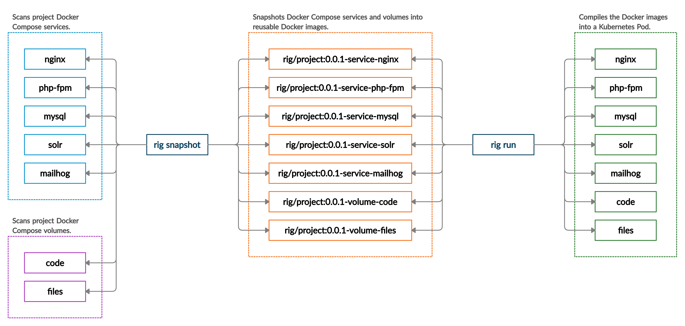

Rig
===

_The particular way in which a sailing boat's masts, sails, and rigging are arranged._

Rig is a tool for snapshotting a Docker Compose stack and reproducing it on Kubernetes as a Pod.

Rig is ideal for demoing features as part of a CI pipeline.

## Usage



**Prepare**

```bash
# Bring the stack up.
$ docker-compose up

# Perform some operations to prepare the environment:
#  * Prepare dependencies
#  * Download static assets
#  * Run a migration

# Down the stack to avoid data issues eg. let MySQL shutdown gracefully.
$ docker-compose down
```

**Configure**

```bash
$ cat .rig.yml 
project: example

services:
  nginx: {}
  php-fpm: {}
  mysql:
    cpu: 150m
    mem: 512Mi
```

**Snapshot and Run**

```bash
$ export RIG_NAMESPACE=default
$ export RIG_REPOSITORY=registry/example
$ export KUBECONFIG=/some/.kube/config

# Snapshot the local Docker Compose stack and push to the registry.
$ rig snapshot 0.0.1

# Run the stack on a remote Kubernetes environment.
$ rig run demo 0.0.1 demo.example.com

# OPTIONAL: Provision a second stack using the same images!
$ rig run demo2 0.0.1 demo2.example.com

# Review the currently running environments
$ rig list
NAME    VERSION DOMAINS             SERVICES
demo    0.0.1   [demo.example.com]  [nginx php-fpm mysql]
demo2   0.0.1   [demo2.example.com] [nginx php-fpm mysql]
```

## Local Development Environment

### Docker Compose

The entire stack is managed by Docker Compose.

It consists of:

* Kubernetes
* Image Registry

To spin it up run the following:

`docker-compose up`

### Registry

Rig builds and pushes images to a registry. To make this all possible we require a consistent DNS entry between the developers local and the cluster.

This is typically a non issue when using cloud registries eg. hub.docker.com.

However, on local this is an issue as the registry is hosted on our test cluster.

To smooth this over we portforward the registry (port 5000) and setup a consistent static DNS entry.

`127.0.0.1	registry.rig.svc.cluster.local:5000`
